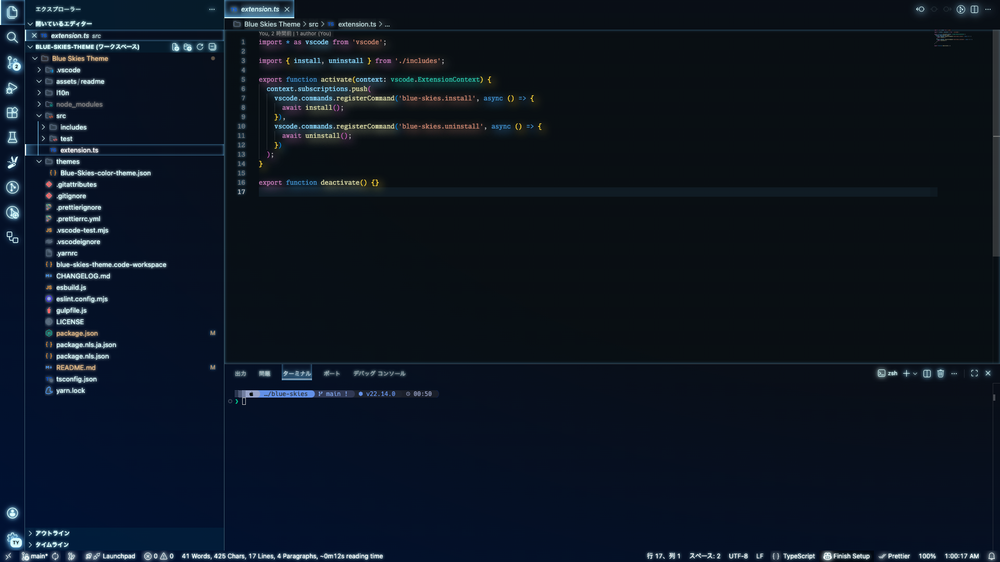
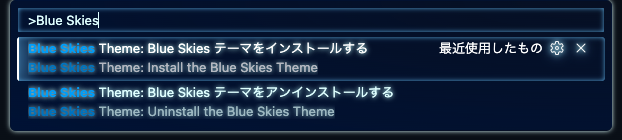
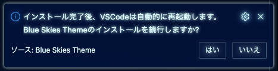
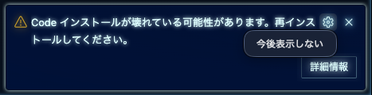
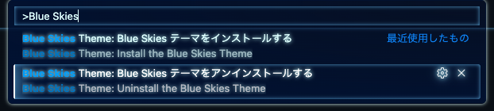

	<h1><i>Blue Skies Theme</i></h1>
	
<i>A wide blue skies theme.</i>

## Warning

This theme has the following issues.

1. Modify VSCode
1. The appearance is altered by adding a stylesheet, which can easily break with VSCode version updates
1. Some parts (shadow DOM, iframe, etc...) may not be able to apply stylesheets, potentially compromising visual consistency
1. We prioritize appearance over readability

Please be aware of them before using it.

## 警告

このテーマには以下の問題点があります。

1. VSCodeを改変します
1. スタイルシートを追加する事で外観を変化させているので VScode のバージョンアップで簡単に壊れる可能性があります
1. 一部のパーツ (shadow DOM, iframe 等...) にはスタイルシートを適用する事が出来ないので視覚的な一貫性が保たれない可能性があります
1. 見やすさより見た目を重視しています

ご利用の際は、それらの問題点をご理解した上でご利用ください。

## エディターに広い青空を

Blue Skies テーマは線と文字というシンプルなエレメントで構成されている VSCode に、光源というエレメントを加える事で今までに無い表現に挑戦したテーマです。

## 使い方

`⇧⌘P` を押下してコマンドパレットを呼び出し、`Blue Skies テーマをインストールする` コマンドを実行します。

インストールすると自動的に VSCode の再起動が行われますので、問題なければ `はい` を押下します。

再起動が完了すると、VSCode 内部のスタイルシートファイルを編集した事によって `Code インストールが壊れている可能性があります。再インストールしてください` と表示されます。

`歯車アイコン` から `今後表示しない` を実行してください。

## 使用を止める時

`⇧⌘P` を押下してコマンドパレットを呼び出し、`Blue Skies テーマをアンインストールする` コマンドを実行します。
